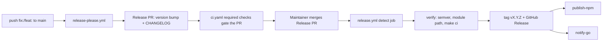

# Release flow (release-please, PR-only mode)

This is the canonical Inari release pattern, piloted in **inari-api** (M1.2 / W1). W2 repos copy it verbatim, adjusting only the publish jobs and the seed version.

## Overview



1. **Propose** — `.github/workflows/release-please.yml` runs on every push to `main`
   (`googleapis/release-please-action@v4`, `skip-github-release: true`). It ONLY opens or
   updates the Release PR: version bump in `.release-please-manifest.json` + `package.json`,
   and a `CHANGELOG.md` diff. It never creates tags or GitHub Releases and never triggers
   publish.
2. **Human gate** — a maintainer reviews and manually merges the Release PR. The normal
   contract CI (`ci.yaml`: buf lint, buf breaking, codegen drift, go build/test, tsc) runs on
   the PR via the `pull_request` trigger and must be a required check.
3. **Execute** — `.github/workflows/release.yml` runs on push to `main`. Its `detect` job
   proceeds only when the head commit matches `^chore(\(main\))?: release` **or**
   `.release-please-manifest.json` changed in the push. It then reads the version from the
   manifest, verifies (semver, go module path vs major version, full `make ci`, package.json
   version match), creates and pushes tag `vX.Y.Z`, creates the GitHub Release with the
   changelog section as body, and runs the publish jobs (npm TS client; the Go module is
   published implicitly by the tag).

## Why publish jobs live in release.yml

The tag is pushed with `GITHUB_TOKEN` inside a workflow. GitHub does not fire tag-push (or any)
triggers for `GITHUB_TOKEN`-authored events, so a separate `on: push tags: [v*]` workflow
**would never run**. Publish therefore lives inline in `release.yml`. If a repo grows many
publish targets, extract them into reusable workflows invoked via `workflow_call` from
`release.yml` — never via tag triggers.

## Config files (copy these)

### `release-please-config.json`

```json
{
  "packages": {
    ".": {
      "release-type": "go",
      "changelog-path": "CHANGELOG.md",
      "bump-minor-pre-major": true,
      "extra-files": [
        { "type": "json", "path": "package.json", "jsonpath": "$.version" }
      ]
    }
  }
}
```

- `release-type: go` — Go module repo; version lives in the manifest only.
- `extra-files` — release-please's `go` type does not touch `package.json`; the generic JSON
  updater keeps the npm client version in sync. Drop this in repos without an npm package.
- `bump-minor-pre-major: true` — while the repo is at 0.x, `feat:` bumps minor and `fix:`
  bumps patch. **Remove this flag once a repo reaches 1.0.0** (then `feat:` → minor,
  `feat!:` → major per standard SemVer).

### `.release-please-manifest.json`

```json
{ ".": "0.2.0" }
```

Seed with the repo's current released version. Managed by release-please afterwards — never
hand-edit except to seed.

### `.github/workflows/release-please.yml` and `.github/workflows/release.yml`

Copy from this repo unchanged except publish jobs. Do not rename: `release.yml`'s `detect`
job keys off release-please's `chore(main): release` commit subject.

## Versioning & breaking changes

- Versions are driven entirely by Conventional Commits: `fix:` → patch, `feat:` → minor
  (0.x), `feat!:` / `BREAKING CHANGE:` footer → major.
- Breaking proto change: mark the commit `!` for a major bump, **and** follow repo policy —
  breaking proto changes require a new proto package version (v1 → v2), never in-place edits.
- `buf breaking` (in `ci.yaml`) stays a required check and gates every PR, including the
  Release PR.
- Never create or push tags by hand. Never cut a GitHub Release by hand. The tag and Release
  come only from `release.yml`.

## Prerequisites

- Repository secret `NPM_TOKEN` (npm publish). Go consumers need nothing — the git tag is
  the Go module release.
- PRs created with the default `GITHUB_TOKEN` do **not** trigger `pull_request` workflows
  (GitHub restriction), so `ci.yaml` will not run on the Release PR and a required `ci`
  check would block the merge. Fix: pass a PAT via `with: token: ${{ secrets.RELEASE_PLEASE_TOKEN }}`
  in `release-please.yml` (a fine-grained PAT with contents + pull-requests on this repo),
  which makes the Release PR a normal PR gated by CI like any other.
- `main` branch protection: require the `ci` workflow check; with the PAT above,
  release-please PRs are normal PRs and are gated the same way.
- Seed `CHANGELOG.md` with the current version section before the first run (release-please
  prepends into it).

## Adopting in a new repo (W2 checklist)

1. Copy `release-please-config.json`, `.release-please-manifest.json`,
   `.github/workflows/release-please.yml`, `.github/workflows/release.yml`.
2. Seed the manifest with the repo's current version; seed `CHANGELOG.md`.
3. Adjust publish jobs in `release.yml` (npm scope/name, container push, etc.) and the
   module-path check for the repo's Go module.
4. Delete any `on: push tags:` publish workflow — move its jobs into `release.yml`.
5. Ensure `NPM_TOKEN` (or equivalent) secret exists and `ci` is a required check on `main`.
6. Push a `fix:` or `feat:` commit → confirm the Release PR opens and nothing else happens.
